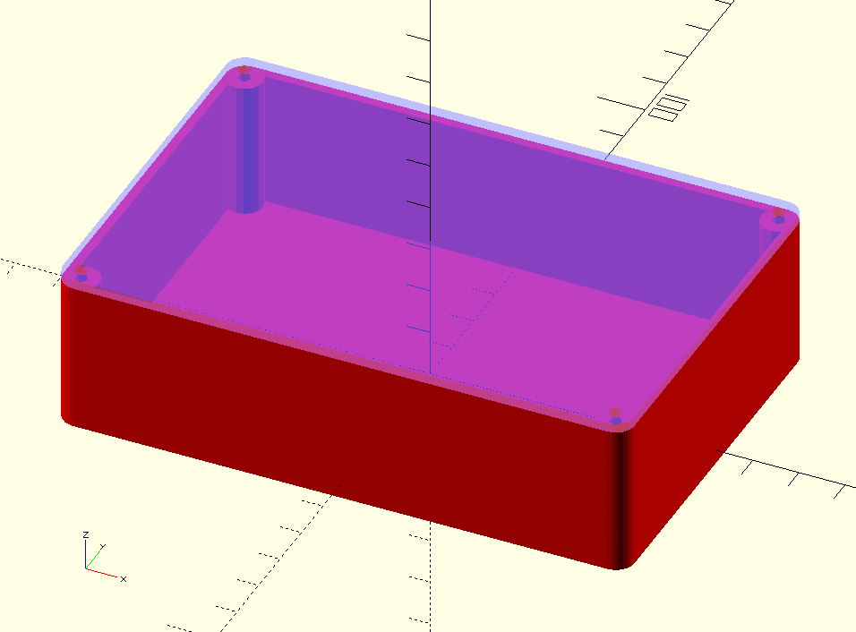

# That Box Again

The box that I always end up designing for every project.
Always.
Without fail.
The same box.
But in [OpenSCAD](https://openscad.org/) this time.

`ThatBox_Lid()` and `ThatBox_Box()` are the functions you are interested in.
The box is configured entirely through the parameters to those modules.

The origin of the box is the bottom centre of the inner volume.
The origin of the lid is the centre of the inner facing (/back) side.
